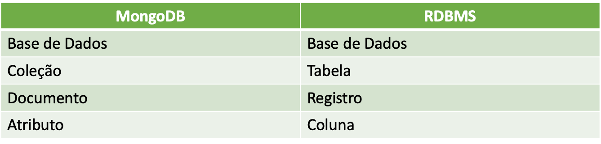

# Mongo

## Características

1. O nome vem da palavra inglesa Humongous que em uma tradução livre quer dizer Gigantesco.
2. Ele é escrito em C++.
3. É Open-source.
4. Tem foco em Alta Disponibilidade e Alta Escalabilidade.
5. É suportado pelas principais distribuições de Linux, Windows e também MacOS.
6. Ele trás também o melhor dos dois mundos (relacional e não relacional).

Do lado relacional destacamos:

* Uma Query Language flexível e poderosa
* Consistência forte (podemos ajustar isso de acordo com nossas necessidades)
* Índices secundários: podemos ter mais de um índice por coleção

Do lado não relacional:

* A flexibilidade de arquitetura e schema design
* Escalabilidade
* Performance

## Comparando com banco relacional



## Ferramentas

* Compass
* Robo 3T
* NoSQL Manager
* *Mongo Shell* (o que vamos utilizar)

## INSERTS

### Escrita

* **Soft State:**  Uma característica do MongoDB, não precisa de possuir estados rígidos, por isso nem sempre são consistentes.

* **Eventually Consistent:** Uma vez possuindo a flexibilidade dada pelo Soft State, explicado anteriormente, vale ressaltar que o sistema se torna consistente no momento devido. Priorizando a disponibilidade sobre a consistência. Lembrar que essas características devem ser levadas em conta na hora que o desenvolvedor desenha sua aplicação.

```js
show dbs
show collections

use class;
db.inventory.insertOne({ item: "journal", qty: 25, size: { h: 14, w: 21, uom: "cm" }, status: "A" })

show dbs
show collections

db.inventory.insertOne({ _id: 2, item: "notebook", qty: 50, size: { h: 8.5, w: 11, uom: "in" }, status: "A" })

db.inventory.insertMany([
  { item: "paper", qty: 100, size: { h: 8.5, w: 11, uom: "in" }, status: "D" },
  { item: "planner", qty: 75, size: { h: 22.85, w: 30, uom: "cm" }, status: "D" },
  { item: "postcard", qty: 45, size: { h: 10, w: 15.25, uom: "cm" }, status: "A" }
]);

// https://docs.mongodb.com/manual/reference/method/db.createCollection/#db.createCollection
db.createCollection( "content", { collation: { locale: "fr" } } );
```

## db.collection.find()

### Selecionando tudo de uma colection

```js
db.inventory.find({}); // ou
db.inventory.find();

// equivalente a SELECT * FROM inventory;
```

### Especificando uma condição de igualdade

```js
// equivalente a SELECT * FROM inventory WHERE status = "D";
db.inventory.find({ status: "D" }); 
// equivalente a SELECT * FROM inventory WHERE status = "D" AND item = "paper";
db.inventory.find({ status: "D", item: "paper" });
```

### Projetando somente os campos requeridos

* query: um documento JSON contendo os filtros que serão aplicados nos documentos;

* projection: outro documento JSON que especifica quais campos dos documentos serão retornados.

```js
db.inventory.find({ status: "A" }, { item: 1, status: 1 }); // ou
db.inventory.find({ status: "A" }, { item: true, status: true });

db.inventory.find({ status: "A" }, { status: 0 }); //ou
db.inventory.find({ status: "A" }, { status: false });
```

### Relacionamentos

**1:1 (um para um)**
```js
// documento do usuário
{
  _id: "joe",
  name: "Joe Bookreader"
}

// documento do endereço
{
  user_id: "joe", // referencia o documento do usuário
  street: "123 Fake Street",
  city: "Faketon",
  state: "MA",
  zip: "12345"
}

db.users.insertOne({
  _id: "joe",
  name: "Joe Bookreader",
  address: {
    street: "123 Fake Street",
    city: "Faketon",
    state: "MA",
    zip: "12345"
  }
});

db.users.find({ _id: "joe" }).pretty();
```

**1:N (um para muitos)**

```js
db.users.insertOne({
  _id: "amanda",
  name: "Amanda Granger",
  addresses: [
    {
      street: "Sunset Boulevard",
      city: "Los Angeles",
      state: "CA",
      zip: "12345"
    },
    {
      street: "1 Some Other Street",
      city: "New York",
      state: "NY",
      zip: "12345"
    }
  ]
 }
);

db.users.find({ _id: "amanda" }).pretty();
```

### Procurando em sub-documentos

```js
db.users.find({ "addresses.state": "NY" }).pretty();
```

## Métodos de cursor limit() e skip()

**limit()**

```js
db.inventory.find().limit(2);
db.inventory.find({ status: "A" }).limit(1);
```

**skip**
```js
db.inventory.find().skip(2);
```

**skip() e limit()**
```js
db.inventory.find({}, { item: 1 }); // retorna todos os cinco documentos
db.inventory.find({}, { item: 1 }).skip(0).limit(2); // retorna o primeiro e segundo documentos
db.inventory.find({}, { item: 1 }).skip(1*2).limit(2); // retorna o terceiro e quarto documentos
db.inventory.find({}, { item: 1 }).skip(2*2).limit(2); // retorna o último elemento
db.inventory.find({}, { item: 1 }).skip(3*2).limit(2); // retorna nada
```

### Remover coleções

```
use class;
db.inventory.drop();
db.users.drop();
```


