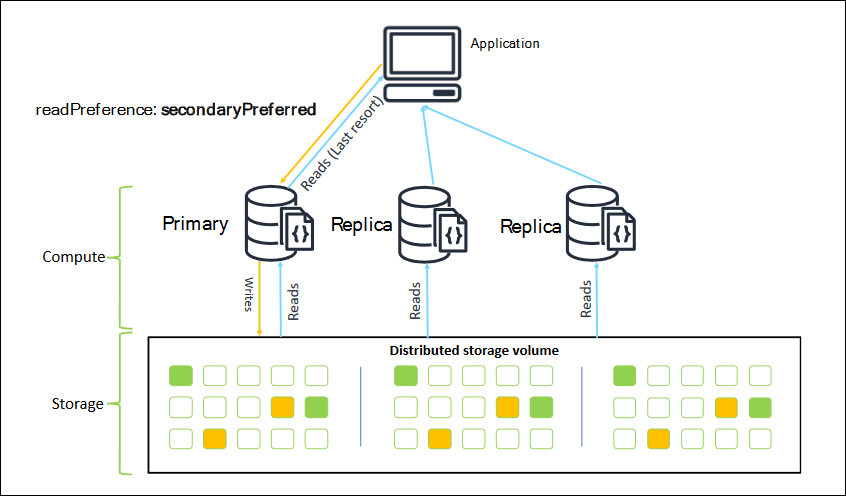
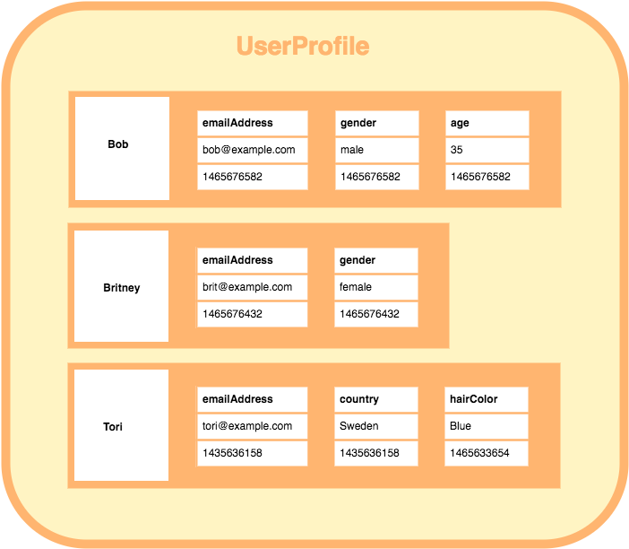

# BLOCO 23 DIA 1 - Introdução a NoSQL

## O que é NoSQL?

*Not Only SQL* 

## Por que utilizar NoSQL?

* Escalabilidade
* Perfomance
* Esquema flexível
* Agilidade

### Clusters   

* Tolerância a falhas
* Balanceamento de carga

  

[Link sobre Clusters](https://www.opservices.com.br/o-que-e-um-cluster/)
[Manual do Mongo sobre Sharding](https://docs.mongodb.com/manual/sharding/)

## Classes de NoSQL

* Chave / Valor - *Key / Value*

  O mais simples dos tipos de bancos de dados não relacionais. Utiliza o método chave-valor para armazenar os dados, em que cada chave representa um identificador exclusivo.

  Ex: [Redis](https://redis.io/), usado no _twitter_, armazena informações _cache_, permitindo melhor desempenho das aplicações.

    
* Família de Colunas - *Column Family*

  Armazena informações na forma de colunas. Conseguimos adicionar profundidade as informações, aninhando as estruturas de colunas em famílias, cada uma com sua chave específica. Fazendo um paralelo com o _SQL_ seria como se cada família fosse uma tabela, e cada uma das colunas suas linhas.

  Ex: [Cassandra](https://cassandra.apache.org/), utilizado nas mensagens privadas do _Instagram_.

    
* Documentos - *Document*

  Bancos de dados feitos para armazenar informação no formato JSON. É uma solução que permite maior acessibilidade, flexibilidade e escala para o desenvolvedor.
  
  Ex: [MongoDB](https://docs.mongodb.com/), que acaba, por suas características, sendo muito utilizado em _Big Data_.  

    
* Grafos - *Graph*

  Contém nós e arestas, onde os nós representam entidades e as arestas as relações entre dois nós.

  Ex: [Neo4J](https://neo4j.com/), utilizado no _eBay_, facilita a pesquisa por produtos, prevendo comportamentos dos usuários com analisa os possíveis _caminhos_ entre os nós.

    

### Comparação de Complexidade x Escalabilidade

