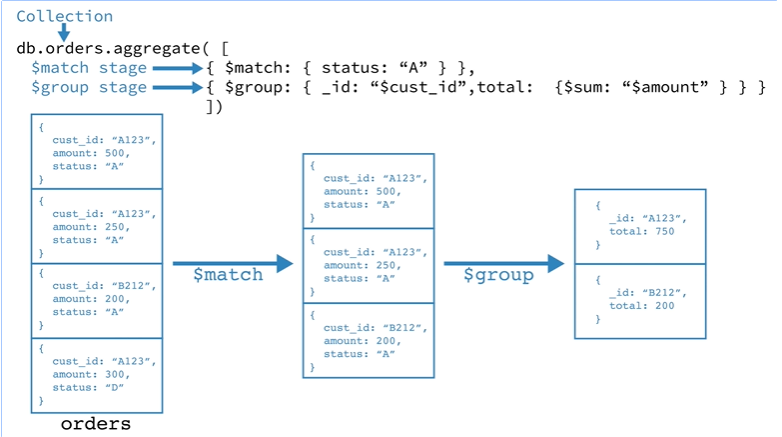

# 26.1 - Aggregation Framework - Parte 1

# O que vamos aprender:

* O que é o aggregations framework?
* Pipelines
* Operadores `$match`, `$count`, `$group`, `$sort`, `$limit`, `$project`, `$unwind`, `$lookup`.

## Importando coleções
```bash
cd 25_1
mongorestore --drop --db pokemongo --collection friends dumps/samples_friends.bson
mongorestore --drop --db pokemongo --collection pokemons dumps/samples_pokemon.bson
mongorestore --drop --db pokemongo --collection customers dumps/DBEnvyLoad_customers.bson
mongorestore --drop --db pokemongo --collection orders dumps/DBEnvyLoad_orders.bson
mongorestore --drop --db pokemongo --collection products dumps/DBEnvyLoad_products.bson
```

## Pipelines



[Aggregation Pipeline](https://docs.mongodb.com/manual/core/aggregation-pipeline/)


## Operador `$match`

```js
db.friends.aggregate([
  { $match: { season: 5 } },
]);

db.friends.aggregate([
  { 
    $match: { 
      airdate: {
        $gte: '1995-01-01',
        $lte: '1995-12-31',
      } 
    } 
  }
]);
```

## Operador `$count`

```js
db.friends.aggregate([
  { $match: { season: 5 } },
  { $count: 'totalEpisodios' }
]);
```

## Operador `$group`

```js
db.friends.aggregate([
  {
    $group: {
      _id: 'null',
      totalEpisodios: { $sum: 1 },
      duracaoTotal: { $sum: '$runtime' },
      mediaDuracao: { $avg: '$runtime' },
      menorDuracao: { $min: '$runtime' },
      maiorDuracao: { $max: '$runtime' }
    }
  }
]);

db.friends.aggregate([
  {
    $group: {
      _id: '$season',
      totalEpisodios: { $sum: 1 },
      duracaoTotal: { $sum: '$runtime' },
      mediaDuracao: { $avg: '$runtime' }
    }
  }
]);
```

* Exemplo de $group com $match (having)

```js
db.friends.aggregate([
  {
    $group: {
      _id: '$season',
      totalEpisodios: { $sum: 1 },
      mediaDuracao: { $avg: '$runtime' }
    }
  },
  {
    $match: {
      season: 3,
      totalEpisodios: { $gt: 24 }
    }
  }
]);
```

## Operador `$sort`

```js
db.friends.aggregate([
  {
    $group: {
      _id: '$season',
      totalEpisodios: { $sum: 1 },
      mediaDuracao: { $avg: '$runtime' }
    }
  },
  {
    $sort: {
      totalEpisodios: -1,
      _id: 1
    }
  }
]);
```

## Operador `$limit`

```js
db.friends.aggregate([
  {
    $group: {
      _id: '$season',
      totalEpisodios: { $sum: 1 },
      mediaDuracao: { $avg: '$runtime' }
    }
  },
  {
    $sort: {
      totalEpisodios: -1
    }
  },
  { $limit: 1 }
]);
```

## Operador `$project`

```js    
db.friends.aggregate([
  {
    $group: {
      _id: '$season',
      totalEpisodios: { $sum: 1 },
      mediaDuracao: { $avg: '$runtime' }
    }
  },
  {
    $sort: {
      totalEpisodios: -1
    }
  },
  { $project: { _id: false, temporada: '$_id', tempoTotalAproximado: { $multiply: ['$totalEpisodios', '$mediaDuracao'] } } }
]);
```

## Operador `$unwind`

Exemplo com pokemon

```js
db.pokemons.aggregate([
  {
    $match: {
      name: 'Bulbasaur'
    }
  },
  { $unwind: '$type' }
]);

db.pokemons.aggregate([
  {
    $match: {
      name: 'Bulbasaur'
    }
  },
  { $unwind: '$type' },
  { $project: { name: true, type: true }}
]);

db.pokemons.aggregate([
  { $unwind: '$type' },
  {
    $group: {
      _id: '$type',
      total: { $sum: 1}
    }
  }
]);

db.pokemons.aggregate([
  { $unwind: '$type' },
  {
    $group: {
      _id: '$type',
      total: { $sum: 1}
    }
  },
  { $sort: { total: -1 } }
]);

db.pokemons.aggregate([
  { $unwind: '$type' },
  {
    $group: {
      _id: '$type',
      total: { $sum: 1}
    }
  },
  { $sort: { total: -1 } },
  { $project: { _id: false, tipo: '$_id', total: '$total' } }
]);
```

## Operador `$lookup`

```js
db.orders.aggregate([
  {
    $lookup: {
      from: 'customers',
      localField: 'CustId',
      foreignField: '_id',
      as: 'customer'
    }
  },
  {
    $unwind: '$customer'
  },
  {
    $project: { 'customer.CustomerName': true }
  },
  {
    $limit: 1
  }
]).pretty();

db.orders.aggregate([
  { $unwind: '$lineItems' },
  {
    $lookup: {
      from: 'products',
      localField: 'lineItems.prodId',
      foreignField: '_id',
      as: 'products'
    }
  },
  {
    $limit: 1
  }
]).pretty();

db.orders.aggregate([
  { $unwind: '$lineItems' },
  { $sort: { _id: 1 } },
  {
    $lookup: {
      from: 'products',
      let: { productId: '$lineItems.prodId' },
      pipeline: [
        {
          $match: {
            $expr: { 
              $eq: ['$_id', '$$productId'],
            }
          }
        }   
      ],
      as: 'product'
    },
  },
  {
    $limit: 5
  }
]);

var categorias = ['Alimentação', 'Limpeza', 'Congelados e frios', 'Higiene pessoal', 'Hortifrúti', 'Bebidas']; 

// Adicionando campo categoria
print(categorias[(Math.random() * categorias.length) | 0]);

db.products.find({}).forEach(function (doc) {
  print(doc._id)
  db.products.updateOne({ _id: doc._id }, {
    $set: { category: categorias[(Math.random() * categorias.length) | 0] }
  })
});

db.products.aggregate([
  {
    $group: { 
      _id: '$category', 
      total: { $sum: 1 }
    } 
  } 
]);


db.orders.aggregate([
  { $unwind: '$lineItems' },
  { $sort: { _id: 1 } },
  {
    $lookup: {
      from: 'products',
      let: { productId: '$lineItems.prodId' },
      pipeline: [
        {
          $match: {
            category: 'Limpeza',
            $expr: { 
              $eq: ['$_id', '$$productId'],
            }  
          }
        }   
      ],
      as: 'product'
    },
  },
  {
    $group: {
      _id: '_id',
      products: { $sum: { $size: '' } }
    }
  }
  {
    $limit: 5
  }
]).pretty();
```


