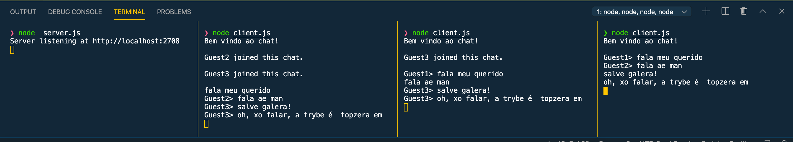

# 32.1 - TCP/UDP & NET

Na aula de hoje vamos abordar um conceito muito importante para qualquer profissional de tecnologia, **sockets**! Vamos ver de forma direta, focando mais na prática. Após isso, nós vamos implementar um chat no terminal!

Como foi dito, na aula de hoje iremos fazer um chat onde qualquer mensagem enviada é feito um *broadcast* para todas as conexões ativas no servidor!

Bom, mas antes de entrarmos na parte prática, vamos entrar rapidamente um pouco na parte teórica para fazer uma recapitulação, pois é super importante que tenhamos esse conteúdo fixado para entendermos profundamente o que está acontecendo por trás das aplicações.

### O que vamos aprender hoje?

* Protocolos TCP e UDP
* Sockets TCP
* Show me a Code ! (Chat)

## Protocolos TCP e UDP

OSI X TCP/IP


Imagem obtida [aqui](https://www.uniaogeek.com.br/arquitetura-de-redes-tcpip/)

Alguns protocolos por camada:


Imagem obtida [aqui](https://pplware.sapo.pt/tutoriais/networking/redes-sabe-o-que-e-o-modelo-osi/)

Agora vamos relembrar um pouco sobre o que é **TCP**, **UDP** e quais as suas diferenças:

* Ambos existem na camada 4 do **modelo OSI** (camada de **transporte**);
* Ambos determinam como uma informação é transmitida na rede;
* Em uma máquina existem mais de 65 mil portas TCP e UDP que podem ser usadas por várias aplicações/serviços;
* Cada porta só pode "ter" uma aplicação (São portas lógicas);
* 2^16 = 65.536 aplicações distintas sendo executadas em simultâneo na nossa máquina;

### TCP

* O TCP é o protocolo mais usado;
* Protocolo seguro;
* Fornece garantia na entrega dos pacotes; 
* Three Way Handshake (SYN, SYN-ACK, ACK);


Imagem obtida [aqui](https://study-ccna.com/tcp-three-way-handshake/)


### UDP

* O UDP é um protocolo mais simples;
* Não fornece garantia na entrega dos pacotes;
* Usando UDP, um **host** envia informações e outros hosts sem qualquer confirmação dos pacotes recebidos;

> Duvidas ?

## Sockets TCP

* Abstração para endereços de comunicação;
* Cada endereço tem um identificador único (**IP**)(Ex. 127.0.0.1:3000 ou localhost:3000);
* Os endereços são para identificar as máquinas (**127.0.0.1**:3000);
* As portas são para identificar uma aplicação (127.0.0.1:**3000**);
* Passos para haver a comunicação:
  * Primeiramente o servidor "escuta" uma porta e aguarda por conexões;
  * Em seguida, o cliente deve saber qual o **IP** e **PORTA** do servidor;
  * O cliente solicita uma conexão ao servidor;
  * Se nenhum problema ocorrer, o servidor aceita a conexão (gera-se um socket em uma porta vaga);
* O comportamento do servidor é básico, ele fica em "loop", aguardando novas ligações e “gerando” sockets para atender as solicitações de clientes;

> Duvidas ?

## Chat

Vamos desenvolver uma aplicação que funcione como uma sala de chat. Na prática essa aplicação irá receber conexão de clientes/pessoas usuárias e armazená-las. Posteriormente, se um cliente enviar uma mensagem, o servidor envia essa mensagem para todos os outros clientes conectados no servidor, ou seja, um usuário pode enviar uma mensagem, através de uma conexão, e essa mesma mensagem será retransmitida para todas as outras pessoas usuárias conectadas.



### Códigos

Vamos começar iniciando um projeto Node com o seguinte comando:

```
$ npm init -y
```

Em seguinda, vamos criar dois arquivos, um para ser o **servidor** e o outro para ser o **cliente**:
```
$ touch server.js
```
```
$ touch client.js
```

> server.js

```
const net = require('net');
const port = 2708;

const server = net.createServer((socket) => {
  socket.on('end', () => {
    console.log('Cliente desconectado');
  });

  socket.on('data', (data) => {
    console.log(`O cliente  disse: ${data}`);
  });

  socket.on('error', (error) => {
    console.log('Erro no socket: ', error.message);
  });
});

/* Evento para caso ocorra algum erro no servidor */
server.on('error', (error) => {
  console.log('Erro no servidor: ', error.message);
});

server.listen(port, () => {
  console.log(`O servidor está escutando na porta ${port}`);
});
```

### Desafios

- [ ] Armazenar nossas conexões (Para fazer retransmissão);
- [ ] Realizar disparo em **broadcast** (Implementar `disparo`);
- [ ] Fazer todas pessoas conectadas receberem a mensagens (Melhorar método `data`);
- [ ] Ao se desconectar dizer adeus (Melhorar método `end`);
- [ ] Implementar o `Client`;